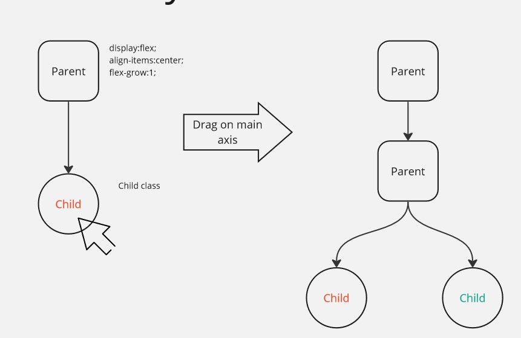

# Infinitely dubsividable, resizable panels

A React panel component that is fully user-customisable, and infinitely subdividable. Make a dashboard that perfectly fits your needs, using intuitive dragging and dropping controls.

Inspired by Blender's [Areas](https://docs.blender.org/manual/en/latest/interface/window_system/areas.html).

The demo below showcases panels that contain a random photo (from [Lorem Picsum](https://picsum.photos/)), fetched automatically whenever the panel changes size.
 

The panels can be resized as the user sees fit, and also subdivided into two panels. Any other HTML or React component can be included inside the panels.

This component is provided headless and has no dependencies apart from React itself.

## Who would use this?
1. Developers who want to play with the dimensions of their layout before settling on a fixed size.
2. Scientists who want to quickly throw together windows full of differently-sized charts and plots.
3. Developers who wish to create a tool with lots of flexibility and user customisation options.
4. 3D modelers/developers who simply miss Blender's UI layout, and would like to use it on the web.

## How it works

The primary component has a `graph` React state which contains a binary tree representation of all the panels. Panels can either be `ParentPanel` or `ChildPanel` types. Upon re-render, the binary `graph` is evaluated, and each node in the graph is interpreted as either a Parent or Child.

When grabbing onto an edge of a `ChildPanel`, the click event propagates up the binary tree until it encounters a `ParentPanel`. Then, the click position relative to the local `ParentPanel` is evaluated, allowing for the `ChildPanel`s of the `ParentPanel` to be resized.

When dividing a `ChildPanel`, a `ParentPanel` and a `ChildPanel` are immediately instantiated. The Parent is placed above the clicked Panel in the `graph`, while the Child is placed as its neighbour.

This structure leads to a heavily nested structure. As such, it is recommended that the developer be familiar with recursive methods in JS, as well as React's [rendering](https://react.dev/learn/render-and-commit).

### To-Do (10-Feb-2024):
- Allow neighbouring `ParentPanel`s to affect each other's size when resizing.
- Implement dynamic resizing - at the moment resizing is done via a clickable div on the bottom-right corner of each `ChildPanel`. Ideally this would take the form of a draggable behaviour, like in Blender.
- Implement panel merging and panel switching. Drag a panel over another in order to merge them both.
- Remove `Resizable.jsx`, `Subdividable.jsx` and other temporary playground files.
